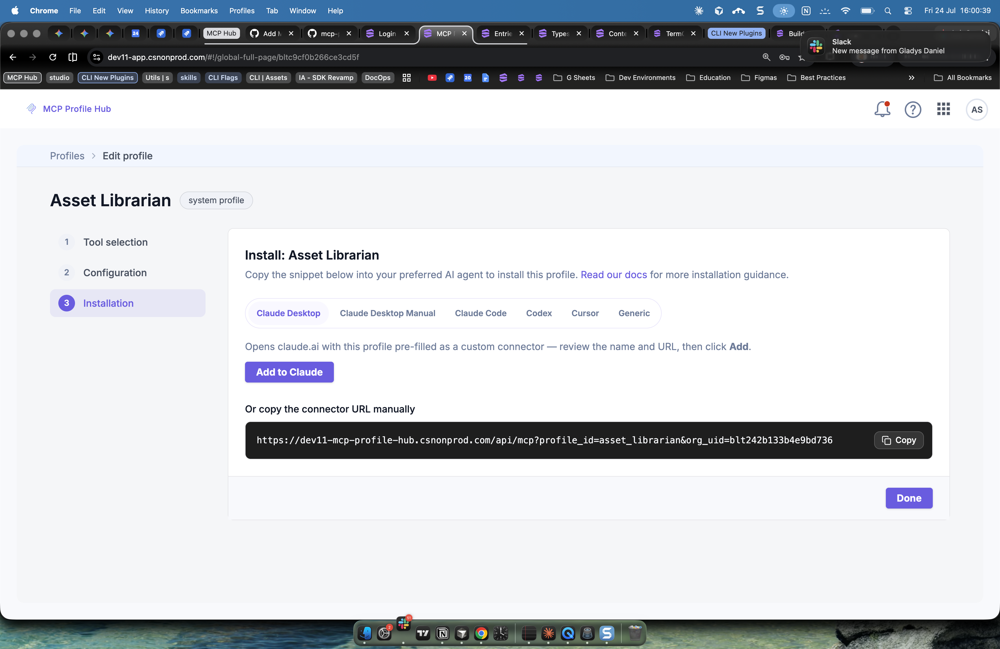

# DocOps Nested Test - Administration

## Overview

This is a temporary test article verifying nested-folder sync, image upload, callouts, and full text formatting for **Administration**. Safe to delete after verification.

Here is some *italic* emphasis and a `inline code span` for good measure.

### Key Points

- First bullet point with **bold text**.
- Second bullet point with an internal link: [Publish Rules](/docs/headless-cms/about-publish-rules).
- Third bullet point with an external link: [W3C](https://www.w3.org).

### Step by Step

1. First numbered step.
2. Second numbered step.
3. Third numbered step.

### Example Command

```bash
echo "docops nested sync test for Administration"
```

### Comparison Table

| Column A | Column B |
|----------|----------|
| Value 1 | Value 2 |
| Value 3 | Value 4 |



**Note:** This is a Note callout used to verify note styling renders correctly.

**Warning:** This is a Warning callout used to verify warning styling renders correctly.

**Tip:** This is a Tip callout used to verify tip styling renders correctly.

**Additional Resources:**

- [Publish Rules](/docs/headless-cms/about-publish-rules)
- [W3C Website](https://www.w3.org)
