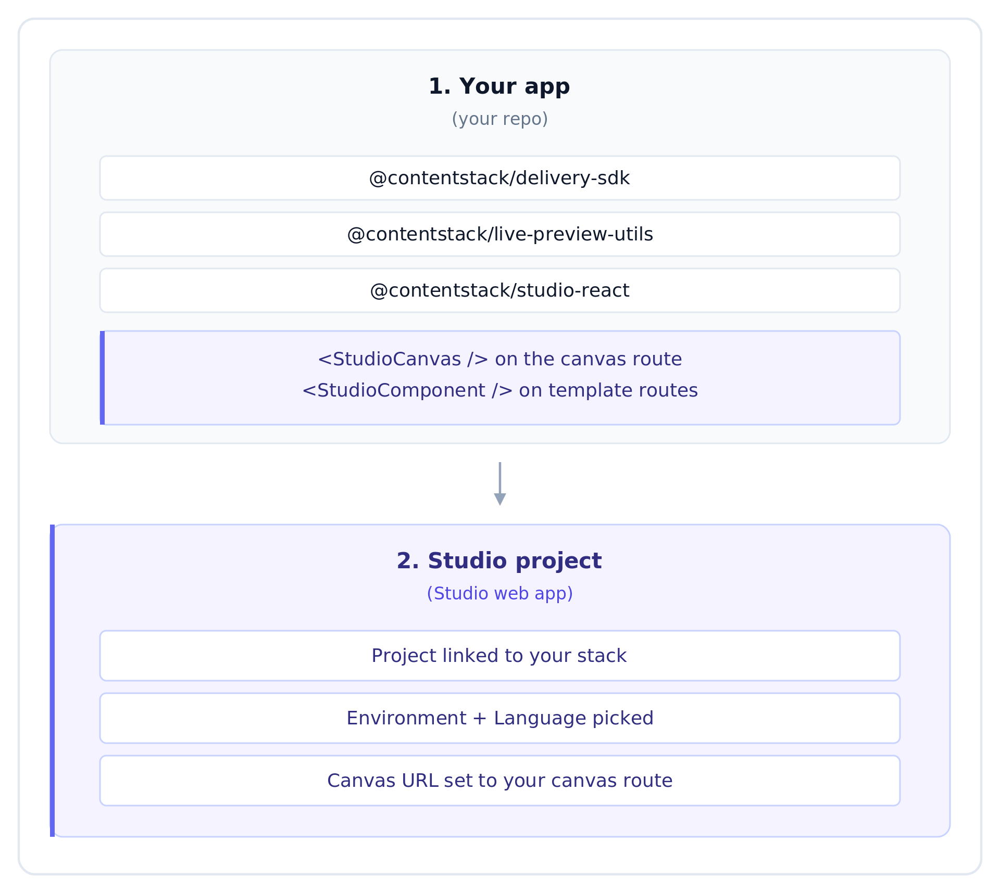

# Setup

Studio install is two layers:



[Prerequisites](prerequisites.md) lists what you need from your Contentstack stack before starting (Stack API Key, Delivery Token, Preview Token, Environment, Language, Visual Editor enabled). Those are stack-side setup, covered in Contentstack's own docs.

## Reading order

| Step | What you'll do |
| --- | --- |
| [Prerequisites](prerequisites.md) | Checklist of what you need from your Contentstack stack |
| **Layer 1: Your app** | |
| → [Install the Delivery SDK](app-prerequisites/01-install-delivery-sdk.md) | Read published content from Contentstack's CDN |
| → [Install Live Preview](app-prerequisites/02-install-live-preview.md) | Set up real-time updates for draft content |
| → [Install the Studio SDK](app-prerequisites/03-install-studio-sdk.md) | Install, initialize, register components, fetch compositions, and mount the canvas |
| → [CSR vs SSR](app-prerequisites/04-csr-vs-ssr.md) | Pick a render strategy. Covers SSR / SSG / RSC patterns + the `searchQuery` requirement |
| **Layer 2: Studio project** | |
| → [Create a Studio project](studio-project/01-create-project.md) | Link it to your stack |
| → [Configure environment + language + canvas URL](studio-project/02-configure-env-locale.md) | Project Settings |
| → [Add the section preview route](studio-project/03-section-preview-route.md) | `<StudioCanvas />` mount |
| → [Wire template preview routes](studio-project/04-template-preview-routes.md) | ONE catch-all `<StudioComponent />` mount (handles every URL) |
| **Final** | |
| → [Verify end to end](verify-end-to-end.md) | Layered smoke test |
| → [Troubleshoot](troubleshoot.md) | When something doesn't work |

## Automated setup with an LLM

```bash
npx @contentstack/studio-skills install
```

Then ask your LLM *"install Studio in this project"*. It will detect your framework, install the three SDKs, ask for your stack credentials, and wire everything up. Works in Claude Code, Cursor, Copilot Chat, and any general-purpose LLM.

## Time to first canvas

Plan on ~15 minutes total if you already have a stack:
- ~10 minutes for Layer 1 (installing + wiring the SDKs)
- ~5 minutes for Layer 2 (creating the Studio project, configuring it)

The LLM path is closer to 5.
